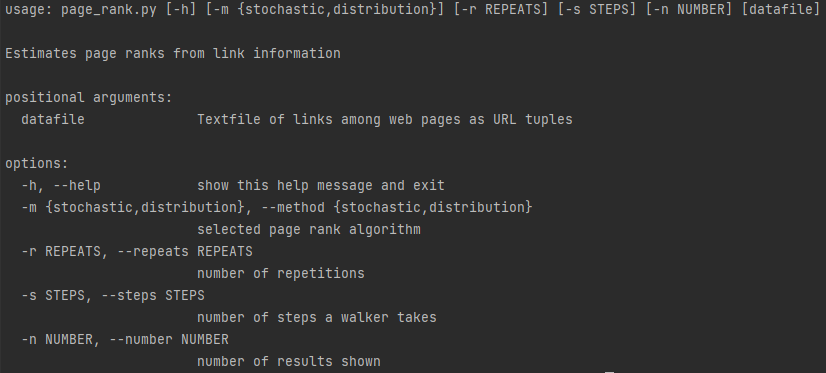

Getting started with Page Rank
=========
This application calculates the page rank of the webpages stored in school_web.txt.
It utilises two methods:
1) Stochastic method
2) Distribution method

This program uses the networkx module,
make sure you have networkx installed with pip command:
```
pip install networkx
```
Once networkx is installed, make you way down to the arguments section of the README.md file for further instructions on how to run the program


### Optimization
I have made a PDF file called ```Stochastic and distribution method before and after optimization evidence.pdf``` which is in the docs
folder. This has the results before and after optimization for evidence that my program improved. Furthermore, my optimization steps can be found in: ```Optimization.md```.

All tests were carried out on my home Computer so test results may differ. My Computer specs are listed below.
##### PC SPECS

* CPU: Intel i9-13900k
* RAM: 32GB Corsair DDR5 5600MHz
* GPU: RTX 3080Ti
* 850w PSU
* Windows 11


Arguments:
=========

### In order to run the program from terminal please use the command line arguments listed below.

#### To see argument list use:
```
python page_rank.py -h
```
#### To run Stochastic method use:
```
python page_rank.py --method stochastic school_web.txt
```
```
python page_rank.py -m stochastic school_web.txt
```
#### To run Distribution method use:
```
python page_rank.py --method distribution school_web.txt
```
```
python page_rank.py -m distribution school_web.txt
```
#### To set number of repeats use (Default = 1,000,000):
```
python page_rank.py --method=stochastic --repeats=1000000 school_web.txt
```
```
python page_rank.py --method=distribution --repeats=1000000 school_web.txt
```
#### To set the number of steps use (Default = 100):
```
python page_rank.py --method=stochastic --steps=100 school_web.txt
```
```
python page_rank.py --method=distribution --steps=100 school_web.txt
```
#### To change number of Top Pages that show up in the results use (Default = 20):
```
python page_rank.py --method=stochastic --number=20 school_web.txt
```
```
python page_rank.py --method=distribution --number=20 school_web.txt
```