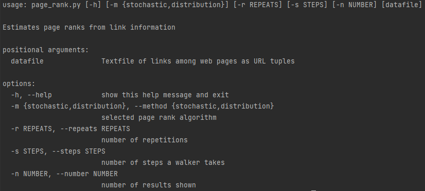

Getting started with Page Rank
==============================
This application calculates the page rank of the webpages stored in school_web.txt.
It utilises two methods:
1) Stochastic method
2) Distribution method

While making this program I needed to research the networkx documentation. I have referenced what methods I have used 
from networkx throughout my work.

Requirements
===========

Inorder to use this app you need to make sure you have the requirements installed from the
requirements folder. Furthermore, if needed, use pip commands:
````
pip install networkx
```` 

1) On GitHub download the file by clicking ***code*** and ***download zip***.
2) Make sure all the requirements are installed.
3) Use the terminal to input the arguments in the command line arguments section.
4) depending on which version of python you're using, write `python` for python version 2 or `python3`
for python version 3 at the beginning of the command line arguments.

Note: You can change the values in the arguments to whatever values you desire.
This has been demonstrated in the arguments section below

Optimization
============


<table>
<tr><th>Unoptimized Stochastic </th><th>Optimized Stochastic</th></tr>
<tr><td>

| Test 1 | Test 2 | Test 3 | Test 4 | Test 5 | Mean time |                 
|--------|--------|--------|--------|--------|-----------|
| 56.40  | 58.38  | 55.45  | 59.01  | 57.37  | 57.73     |

</td><td>

| Test 1 | Test 2 | Test 3 | Test 4 | Test 5 | Mean time |   
|--------|--------|--------|--------|--------|-----------|
| 36.81  | 37.24  | 36.60  | 36.90  | 37.15  | 36.94     |

</td></tr> </table>

<table>
<tr><th>Unoptimized Distribution </th><th>Optimized Distribution</th></tr>
<tr><td>

| Test 1 | Test 2 | Test 3 | Test 4 | Test 5 | Mean time |
|--------|--------|--------|--------|--------|-----------|
| 0.08   | 0.08   | 0.08   | 0.08   | 0.08   | 0.08      |

</td><td>

| Test 1 | Test 2 | Test 3 | Test 4 | Test 5 | Mean time |
|--------|--------|--------|--------|--------|-----------|
| 0.07   | 0.07   | 0.07   | 0.07   | 0.07   | 0.07      |

</td></tr> </table>
                                    


 

I have made a PDF file called [Optimization_evidence.pdf](Optimization_evidence.pdf) . 
This has the results before and after optimization for evidence that my program improved. Furthermore, 
my optimization report/steps can be found in: [Optimization.md](Optimization.md).

All tests were carried out on my home Computer so test results may differ. My Computer specs are listed below.
##### PC SPECS

* CPU: Intel i9-13900k
* RAM: 32GB Corsair DDR5 5600MHz
* GPU: RTX 3080Ti
* 850w PSU
* Windows 11


Arguments:
=========

### In order to run the program from terminal please use the command line arguments listed below.

#### To see argument list use:
```
python page_rank/page_rank.py -h
```
#### To run Stochastic method use:
```
python page_rank/page_rank.py --method stochastic data/school_web.txt
```
```
python page_rank/page_rank.py -m stochastic data/school_web.txt
```
#### To run Distribution method use:
```
python page_rank/page_rank.py --method distribution data/school_web.txt
```
```
python page_rank/page_rank.py -m distribution data/school_web.txt
```
#### To set number of repeats use (Default = 1,000,000):
```
python page_rank/page_rank.py --method=stochastic --repeats=1000000 data/school_web.txt
```
```
python page_rank/page_rank.py --method=distribution --repeats=1000000 data/school_web.txt
```
#### To set the number of steps use (Default = 100):
```
python page_rank/page_rank.py --method=stochastic --steps=100 data/school_web.txt
```
```
python page_rank/page_rank.py --method=distribution --steps=100 data/school_web.txt
```
#### To change number of Top Pages that show up in the results use (Default = 20):
```
python page_rank/page_rank.py --method=stochastic --number=20 data/school_web.txt
```
```
python page_rank/page_rank.py --method=distribution --number=20 data/school_web.txt
```